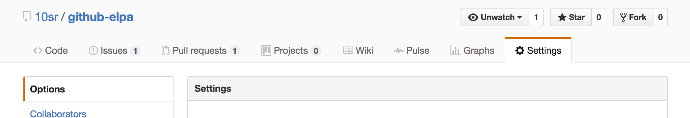
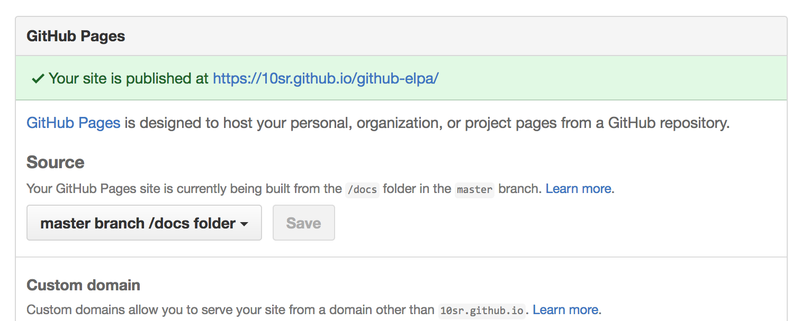

github-elpa
===========

Build and publish your own ELPA repositories with GitHub Pages

Overview
--------

`github-elpa` is an Emacs command-line utility to build your own
`package.el`-compatible package repository in your git repository.
By default this repository will be built into `docs/elpa` directory,
so by just pushing it to GitHub you can publish the repository with
GitHub Pages.

Setting up a repository and updating packages are really easy.
Once you add a [`Cask`](https://github.com/cask/cask) file and package
recipes in
[MELPA's format](https://github.com/melpa/melpa#recipe-format),
issue just one simple command to update the ELPA repository.

Quick Start
-----------

This section describes how to setup your ELPA repository in your
GitHub repository.

### 1. Prerequisite

* A GitHub account, and a GitHub respository that you have a
  write-permission and can change `Settings`
* [Cask](https://github.com/cask/cask)

### 2. Prepare Cask File

Put `Cask` file to the root of the GitHub repository.  Typically it
should look like:

    (source gnu)
    (source melpa)

    (depends-on "github-elpa")

### 3. Add Recipes

Add recipe files in
[MELPA's format](https://github.com/melpa/melpa#recipe-format).
By default `github-elpa` looks for `recipes/` directory, but you can
change this via `-r` command-line option (see below).

### 4. Build Archive

Once you put your recipe files, it is time to build your repository!

Issue following commands:

    cask install  # Need only once
    cask exec github-elpa update
    git push

The second command will fetch packages described in `recipes/`, build
archives into `docs/elpa`, and git-commit them.

### 5. Change Repository Setting

After you push `docs/` directory, you need to change the GitHub
repository setting.
This setting is needed so that the ELPA repository can be
accessed as a GitHub Pages.

1. Go `Settings` page of your GitHub repository

  

2. In `GitHub Pages`, change `Source` to `master branch /docs folder`
  and `Save` it

  

### 6. Add to Repository List

Now it's all done!

The published ELPA repository URL is
`https://<username>.github.io/<repository>/elpa/`.
For example, to use the repository of `github-elpa` itself, add
following to your `init.el`:

    (setq package-archives
          `(,@package-archives
            ("github-elpa" . "https://10sr.github.io/github-elpa/elpa/")))

### 7. Update Repository

When package upstreams are updated, you can receive the changes
in the same way as first building the repository:

    cask exec github-elpa update
    git push

Command-Line Arguments
----------------------

### Subcommands

    github-elpa update

If you just wanto to do "all", issue `update`.

Actually this is just a combination of the following `build` and
`commit` subcommands.

    github-elpa build

Issue `build` to only update packages without committing them.
This command reads recipes in `recipes/` (or the directory specified
by `-r` optiion), fetches packages and builds them by recipes.
In short, this command is just a thin wrapper around
`package-build.el`.

    github-elpa commit

`commit` subcommand commit packages to git repository.
This command will git-commit files in `docs/elpa/` (or the directory
 given by `-a`), and do not commit any other files.

### Options

| Option                            | Default                | Description |
| --------------------------------- | ---------------------- | ----------- |
| `-r, --recipes-dir <recipes-dir>` | `recipes`              | Specify directory that contains recipe files |
| `-a, --archive-dir <archive-dir>` | `docs/elpa`            | Specify directory in which to keep compiled archives |
| `-w, --working-dir <working-dir>` | `.github-elpa-working` | Specify directory in which to keep checkouts |

License
-------

This software is unlicensed. See `LICENSE` for details.
